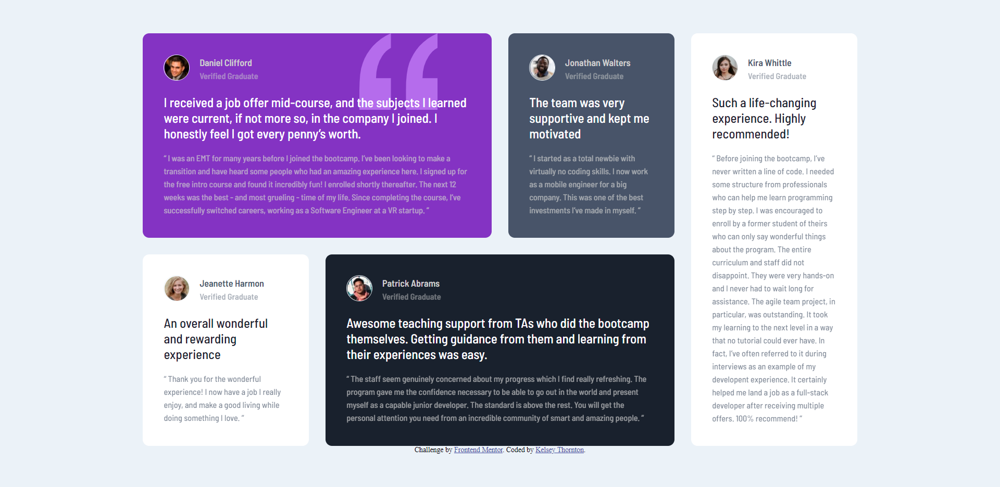

# Frontend Mentor - Testimonials grid section solution

This is a solution to the [Testimonials grid section challenge on Frontend Mentor](https://www.frontendmentor.io/challenges/testimonials-grid-section-Nnw6J7Un7). Frontend Mentor challenges help you improve your coding skills by building realistic projects.

## Table of contents

- [Overview](#overview)
  - [The challenge](#the-challenge)
  - [Screenshots](#screenshots)
  - [Links](#links)
- [My process](#my-process)
  - [Built with](#built-with)
  - [What I learned](#what-i-learned)
- [Author](#author)

## Overview

Theoretically a more challenging project than the previous challenge I took on, but I found it somewhat easier as I find that working with grid is more intuitive than working with flexbox.

### The challenge

Users should be able to:

- View the optimal layout for the site depending on their device's screen size

### Screenshots


Desktop view of the final markup.


Tablet view of the final markup (cropped).
This view isn't in the specification, but I felt that the "mobile" view looked too stretched-out, and the "desktop" view too cramped when viewed on a tablet so I added this.


Mobile view of the final markup (cropped).

### Links

- Solution URL: [Here](https://github.com/KelseyThornton/testimonials-grid-section-main)
- Live Site URL: [Here](https://kelseythornton.github.io/testimonials-grid-section-main/)

## My process

- Initially create the HTML file and look at the rendered document on a narrow window (simulate mobile view).
- Separate the content in to logical packets:
  - Each of the "cards" was defined as an <section>
  - The "cards" were grouped together in a "card-container" <div>
- CSS was generated to render the "cards" in a CSS grid, using grid areas to define the layout (initially a 1 x 5 "grid"). This allowed for easier relocation of the various "cards" in the grid on wider displays.
- Media query added for screens above 500 pixels wide ("tablet").
  - CSS grid redefined to be a 2 x 4 grid and the areas defined appropriately.
- Media query added for screens above 1100 pixels wide ("desktop").
  - CSS grid redefined to be a 4 x 2 grid and the areas defined appropriately.
- <main> added around the whole site so that it can be centred both vertically and horizontally on the screen when screen real-estate allows.

### Built with

- Semantic HTML5 markup
- CSS custom properties
- CSS Grid
- Mobile-first workflow

### What I learned

You can use CSS variables to define other CSS variables where that colour will be different for a card or group of cards.
e.g.

```css
.card {
  background-color: var(--clr-card-bg);
  ...
  color: var(--clr-text);
  ...
}

.intro {
  color: var(--clr-intro);
  ...
}

.card-daniel {
  --clr-card-bg: var(--clr-mod-violet);
  ...
}

.card-jonathan {
  --clr-card-bg: var(--clr-dk-gryblue);
  ...
}

.card-patrick {
  --clr-card-bg: var(--clr-dk-blkblue);
  ...
}

/* Text colour is different on lighter or darker blocks */
.card-daniel,
.card-jonathan,
.card-patrick {
  --clr-text: var(--clr-lt-grey);
  --clr-intro: var(--clr-white);
}

.card-kira,
.card-jeanette {
  --clr-card-bg: var(--clr-white);
  --clr-text: var(--clr-dk-gryblue);
  --clr-intro: var(--clr-dk-blkblue);
}

```

## Author

- Website - [Kelsey Thornton](https://github.com/KelseyThornton)
- Frontend Mentor - [@KelseyThornton](https://www.frontendmentor.io/profile/KelseyThornton)
